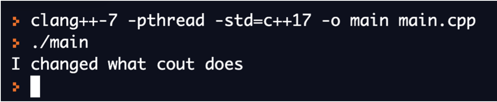

# Report
## Ahmed Farrukh
### Course Management System
#### Introduction

The aim of my code is to create a simple version for a course management system. The program should store data about courses, allow students to view information about the courses they are enrolled in and allow faculty to view and edit information about the courses that they are teaching. In addition, the program should also mantain data about which courses are offered, who is teaching them and who is enrolled in these courses.

#### Approach

I created three classes: Course, Student and Faculty. 

Course stores the following information:
- Course Name
- Course Number
- Faculty Object
- A Vector of Pointers to Student Objects
- Course Description
- Name of the Syllabus File
- Name of the Course Materials file

Faculty stores the following information:
- Name of the Instructor
- A Vector of Pointers to Courses taught by the Faculty member

Student stores the following information:
- Name of the Student
- A Vector of Pointers to the Courses the Student is Enrolled in
- A Vector of Grades

The objects are, therefore, all interconnected to each other. By creating these three classes, the program is able to store data about all three entities (students, teacher and courses) and how they all relate to each other. 
Below is a diagram of the members and functions of each of these classes:


Here is how you highlight a code snippet:

```c++
#include <iostream>
using namespace std;

int main() {
  cout << "Hello World!";
  return 0;
}
```

Here is how you insert a screenshot of your code (or any other image):


