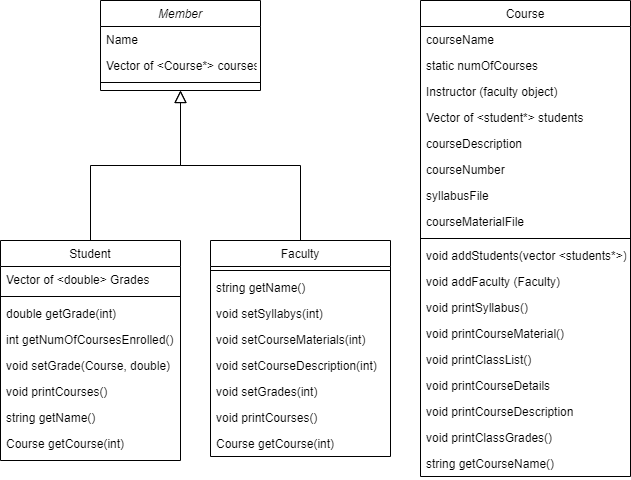
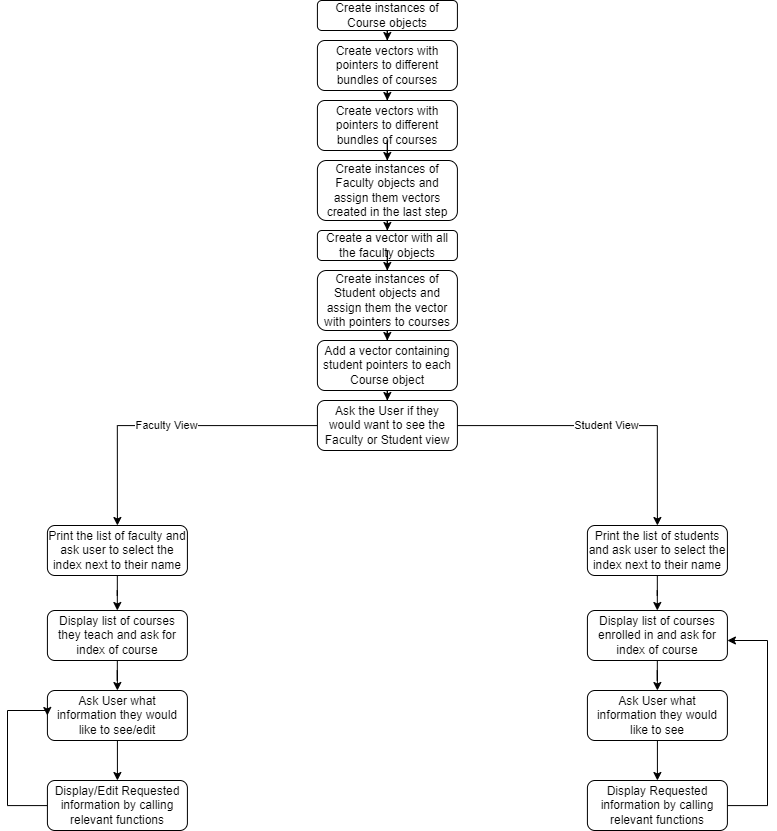
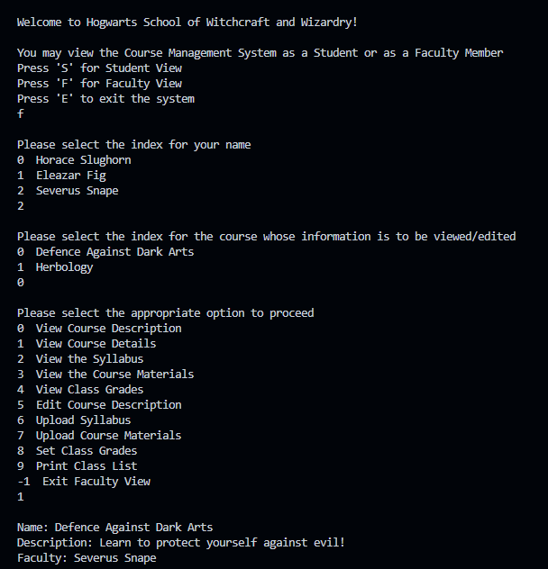
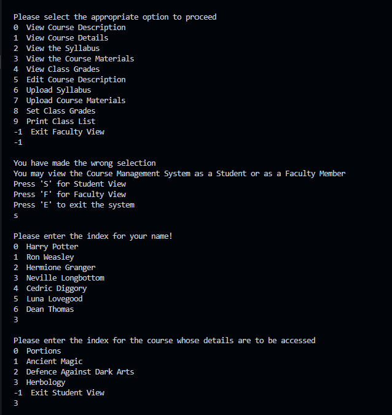
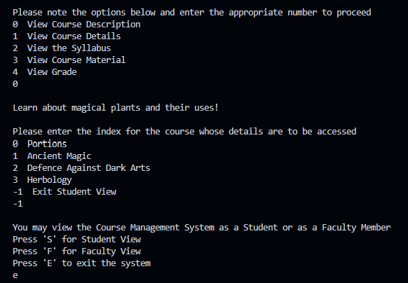

# Report: Course Managment System
## Introduction

The aim of my code is to create a simple version for a course management system. 

A course management system is a software tool used to host course information such as syllabi and provide a medium of interaction between teachers and learners<sup>[1]</sup>. In addition, an effective course management system is supposed to host all the neccessary details of a course, allowing a single platform to be acccessed for all resources regarding a course; it is different from a learning management system, which is generally made specifically for remote learning<sup>[2]</sup>. Course management systems are helpful for both remote and in-person teaching enviornments as both greatly benefit from the presence of online access to course resources<sup>[3]</sup>.

The program should store data about courses, allow students to view information about the courses they are enrolled in and allow faculty to view and edit information about the courses that they are teaching. In addition, the program should also mantain data about which courses are offered, who is teaching them and who is enrolled in these courses. A course management system, the likes of which are used in universities, mantains large sets of data that need to be stored orderly<sup>[4]</sup>. This challenge needs to be tackled using effective ways of storing and sharing information. 

## Approach
In terms of the functionality of the system, I implemented the following functions.

Students should be able to see a list of the courses they are enrolled in and for each course, be able to:
- View Course Descripton
- View Course Details (Course Name, Faculty Name, Course Description)
- View the syllabus
- View Course Materials
- View Grade

Faculty should be able to see a list of courses they are teaching and for each course, be able to:
- View Course Description
- View Course Details
- View Course Materials
- View Class' Grades
- Edit the Course Description
- Upload the Syllabus
- Upload Course Materials
- Set Class Grades
- Print Class List

To achieve this, I created three classes: Course, Student and Faculty. 

Course stores the following information:
- Course Name
- Course Number
- Faculty Object
- A Vector of Pointers to Student Objects
- Course Description
- Name of the Syllabus File
- Name of the Course Materials file

Faculty stores the following information:
- Name of the Instructor
- A Vector of Pointers to Courses taught by the Faculty member

Student stores the following information:
- Name of the Student
- A Vector of Pointers to the Courses the Student is Enrolled in
- A Vector of Grades

The objects are, therefore, all interconnected to each other. By creating these three classes, the program is able to store data about all three entities (students, teacher and courses) and how they all relate to each other. 

## Solution
A class called Member was created that represents a member of the university. Each object of the Member class holds a name variable and a vector of pointers to the courses it is associated to. Both Student and Faculty class are inherited from the Member class.
The following class diagrams show the different classes that were implemented, their data members and member functions.


As can been seen in the class diagram, each class maintains access to objects of another class. Course objects have a Faculty data member and a vector of pointers to Student objects enrolled in the Course. Both Faculty and Student classes hold vectors of pointers to Course objects they are associated with. The interdependence of classes creates problems during class declarations. To solve this challenge, Student and Faculty classes were declared in the Header file first, but their functions were not defined, only declared. Next, Course class was declared. Finally, the functions of Faculty and Student classes were also declared. By following this pattern, each class is declared before its objects are manipulated by the function of another class, and the code runs without error.

### Key Functions inside Classes
Here are some of the key functions inside the declared classes.
- printSyllabus in Course
```c++
void printSyllabus(){//prints the contents of the syllabus file. if wrong name is input, or no name input yet, throws an exception
try{
ifstream inFile;
inFile.open(syllabusFile,ios::in);
if(inFile.fail()){
    throw(syllabusFile);
}
char character;
while(!inFile.eof()){
    character=inFile.get();
    if(character==inFile.eof()){break;}
    cout<<character;
}
cout<<endl;
inFile.close();
}catch(string syllabusFile){cout<<"There was an error opening the syllabus file.\n Note that the syllabus is only available once the instructor has uploaded it."<<endl;}
}
```
The printSyllabus function, is similar to the printCourseMaterial function, and prints the contents of the syllabus file, given the name of the file has been updated by a Faculty object. If the file name has not been updated or is incorrect, an exception is thrown.

- print classGrades in Course
```c++
void printClassGrades(){
double sum=0;
int j;
cout<<"The grades are as follows: "<<endl;
for(int i=0;i<students.size();i++){//prints the grade for each student
        for(j=0;j<students[i]->getNumOfCoursesEnrolled();j++){//find the relevant index of course in the courses vector held by the student
            if(students[i]->getCourse(j).getCourseName()==courseName){
            break;
            }
        }
    cout<<setw(40)<<left<<students[i]->getName()<<setw(5)<<left<<students[i]->getGrade(j)<<endl;//make pretty
    sum+=students[i]->getGrade(j);
}
cout<<setw(40)<<left<<"The average grade is "<<sum/(double)students.size()<<endl;
}
```
This function prints the grades for each student in a class. Using a for-loop, it cycles through every student in the students vector held by the course. Then it compares each course taken by the student to the course in question, to find the index of this course in the student's list of courses. The function then gets the grade of the student using the index found through the last step. Next, it prints the names of the students with their grades next to their names. In addition, it also calculates and prints the average grade for the class.

- setCourseDescription in Faculty
```c++
void Faculty:: setCourseDescription(int i){//sets new course description for specified course
cout<<"Please enter the new course description"<<endl;
string newdescription="";
cin.ignore();
getline(cin,newdescription);//getline used as only new line is to be used as delimiter
courses[i]->courseDescription=newdescription;
}
```
This function asks the user for a new course description and then puts the input into the course description variable for the course referenced by the input index i (i would already be provided by the user through the main function). Since Faculty is a friend of Course, a setter is not needed and the variable is updated directly.

- setGrades in Faculty
```c++
void Faculty:: setGrades(int i){//allows setting of grades for every student in the class.
double g;
cout<<"Please enter the grade for each student"<<endl;
for(int j=0;j<courses[i]->students.size();j++){
    cout<<setw(20)<<left<<courses[i]->students[j]->getName();
    cin>>g;
    courses[i]->students[j]->setGrade(*courses[i],g);
}
}
```
This function, first, prints the name of every student using the students vector in the course referenced by the input index i (index i is already known through the user's selection of the course in the main function). Next, it allows you to input the grade for each student next to their name, which is then taken as an input to the setGrade function held by each Student object.

### Main Function
Following is the flow in my main function:


#### Initialization of Objects
Course objects are created first, and initially have their name and description assigned to them.
```c++
Course A("Portions","Learn the art of brewing powerful potions!");
```
Next, vectors containg pointers to these courses are created. Each vector represents the courses taught by a single faculty member. 
```c++
vector <Course*> teach1;
teach1.push_back(&A);
```
Next, Faculty Members are created inside a vector of Faculty objects and assigned a name and the vector of pointers to the courses they are supposed to teach.
```c++
vector <Faculty> faculty;
faculty.push_back(Faculty ("Horace Slughorn", teach1));
```
Next, a process similar to the one used for the faculty is used to generate vectors of courses taken by different groups of students. For simplicity, however, this piece of code assumes that all students take the same courses, and therefore, only one vector of course objects is required. However, the rest of the code structure can easily accomodate the possbility of different students having different course combinations.
```c++
vector <Course*> courses;
courses.push_back(&A);
```
Next, Student objects are created inside a student vector, with each being assigned a name and the vector of pointers to courses. 
```c++
vector <Student> students;
students.push_back(Student("Harry Potter", courses));
```
Finally, the vector of student objects is used to generate a vector of pointers to the same student objects. This vector of pointers is then assigned to each of the courses taken by these students.
```c++
for(int i=0;i<students.size();i++){
studentptrs.push_back(&students[i]);
}
courses[0]->addStudents(studentptrs);
```
With this, all Course, Student and Faculty objects have been initialized. It may have been noticed that each object maintains a vector of pointers to other objects instead of just of a vector of objects. This is because when a vector is created, objects are copied into it by value, instead of by reference. By making a vector, therefore, access is lost to the original variable and only a copy remains. Since my code aims to manipulate the original variable, pointers are used so that the objects being manipulated remain constant throughout the code and no copies are generated.
#### Print Menu
The print menu gives the user the option to see the faculty view,  the student view or exit the program. The menu exists inside a loop so that unless the exit option is chosen, it will be reprinted everytime the user exits a specific view.
```c++
cout<<"You may view the Course Management System as a Student or as a Faculty Member"<<endl;
cout<<"Press 'S' for Student View"<<endl;
cout<<"Press 'F' for Faculty View"<<endl;
cout<<"Press 'E' to exit the system"<<endl;
cin>>view_selection;
```
#### Student View
Once the student view is selected, the user is prompted to select a course.
```c++
cout<<"Please enter the index for the course whose details are to be accessed"<<endl;
students[student_select].printCourses();
print(-1,"Exit Student View");//the user should enter -1 to exit the student view
cin>>course_select;
```
Next, the user is asked to select the appropriate index for the information they would like to see. Categories include: View Course Description, View Course Details, View the Syllabus, View Course Material, View Grade.

Once selected, the appropriate function is called using an if-else block. 
In general, the function calls look like this:
```c++
students[student_select].getCourse(course_select).printCourseDetails();
```
The specific student object is called from the students vector, the course selected is then retrieved using the getCourse function and then the printCourseDetails function for the course retrieved is called. To view different information, the function called by the retrieved course is changed.

Once, information has ben viewed, the user is once again prompted to select the course whose infomation they would like to see, or to exit the view.

#### Faculty View
Once the faculty view is selected, the user is prompted to select a course.
```c++
cout<<"Please select the index for the course whose information is to be viewed/edited"<<endl;
faculty[faculty_select].printCourses();
cin>>course_select;
```
Next, the user is asked to select the appropriate index for the information they would like to see. Categories include: View Course Description, View Course Details, View the Syllabus, View Course Material, View Class Grades, Edit Course Description, Upload Syllabus, Upload Course Materials, Set Class Grades, Print Class List.

Once selected, the appropriate function is called using an if-else block. 
In general, the function calls look like this:
```c++
faculty[faculty_select].getCourse(course_select).printCourseDetails();
```
The specific faculty object is called from the faculty vector, the course selected is then retrieved using the getCourse function and then the printCourseDetails function for the course retrieved is called. To view different information, the function called by the retrieved course is changed. In general, functions to view course information belong to the Course class, whereas functions to edit information in the Course class belong to the Faculty object. (Faculty is a friend of the Course class). This adds an extra layer to protection and makes sure that student objects can not change any of the course details, since they can only be changed through the faculty class and a student object has no faculty member.

Once, information has ben viewed, the user is once again prompted to select what infomation they would like to see, or to exit the view.

Here is what the code output looks like:






## Optimization Techniques
- Inline Functions
I have used inline functions to print efficiently as they are replaced by the compiler where referenced at runtime. Since menus are printed again and again in the code, with very simialr format each time, inline functions makes the code readable while still allowing efficiency. 
Example: Line 93 of the main file:
```c++
 print(0,"View Course Description");
```

- Vectors (STL)
Vectors have been used in place of large static arrays. By providing dynamic memory allocation, they make sure that the memory occupied by the program is close to its need and not much over neccessary as would be the case for static arrays.
Example: Line 21 of of the main file:
```c++
vector <Course*> teach1;
```

-  Passing by reference
Wherever possible, values were passed to functions by reference. When passing by value, a copy of the variable is generated which takes time and memory, in constrast, passing by reference does not generate an additional copy.
Example: Line 15 of the header file:
```c++
Student(string name, vector<Course*>& courses);
```

- Prefix Increment
Variables have been prefix incremented (++i, instead of i++) as postfix incrementation leads to the creation of a temporary variable that slows down the program. This may be a minor optimization but since incrementing taking place so frequently through the code, the effects add up.
Example: Line 53 of the main file
```c++
for(int i=0;i<students.size();++i)
```

## OOP Concepts
- Inheritance: Both Faculty and Student classes are inherited from the Member class. The Member class has two important variables (name and course vector) that are common to both classes. It also makes intuitive sense since both faculty and students are members of the university system.
```c++
class Student: private Member{
```
- Friendhsip: The Faculty class is a friend of the Course class so that it may edit the variables of the Course class. 
```c++
class Course{
friend class Faculty
```
- Static Variable: The number of courses has been declared as a static variable, since it should be outside a specific object and needs to count each instance when an object is created.
```c++
 static int numOfCourses;
```
- 'this' Keyword: The this keyword has extensively been used in constructors to refer to the object whose constructor has been called.
```c++
this->courseName=courseName;
```
- 'throw-exception': Exceptions have been used when opening files, incase the file name is incorrect or yet to be updated.
```c++
try{
ifstream inFile;
inFile.open(syllabusFile,ios::in);
if(inFile.fail()){
    throw(syllabusFile);
    }
    char character;
    while(!inFile.eof()){
    character=inFile.get();
    if(character==inFile.eof()){break;}
    cout<<character;
    }
    cout<<endl;
    inFile.close();
    }catch(string syllabusFile){cout<<"There was an error opening the syllabus file.\n Note that the syllabus is only available once the instructor has uploaded it."<<endl;}
    }
```

#### References
<sup>[1]</sup> https://cft.vanderbilt.edu/guides-sub-pages/course-management-systems/#:~:text=A%20course%20management%20system%20

<sup>[2]</sup> https://elearningindustry.com/cms-vs-lms-key-differences-course-management-systems-learning-management-systems

<sup>[2]</sup> http://web2integration.pbworks.com/f/COURSE+MANAGEMENT+SYSTEMS.pdf

<sup>[4]</sup> https://www.programmingwithbasics.com/2023/01/student-management-system-project-in-cpp.html
